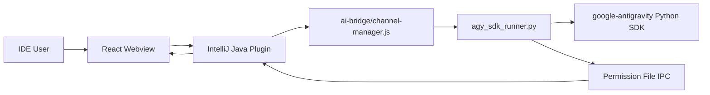

# Agy Python SDK Support Design

## Goal

Add Antigravity (`agy`) as a first-class provider in the IntelliJ plugin, using the official Python SDK (`google-antigravity`) as the primary runtime and preserving the existing Claude/Codex user experience: streaming chat, provider switching, model selection, dependency installation, interruption, and permission-mode switching.

The implementation must not route unknown providers through Claude. `agy` must be explicitly handled in Java, Node, Python, and the webview.

## Current State

The repository is currently on branch `agy-dev`, reset to `origin/main` at commit `d3b9d044`.

The project has three runtime layers:

- Java IntelliJ plugin under `src/main/java/com/github/claudecodegui`
- Node bridge under `ai-bridge`
- React webview under `webview`

Claude and Codex are the only enabled providers today. Several places use a two-provider branch where `codex` is handled explicitly and all other values fall back to Claude. Those branches must be fixed before enabling `agy`.

Key files:

- `src/main/java/com/github/claudecodegui/session/SessionSendService.java`
- `src/main/java/com/github/claudecodegui/session/SessionProviderRouter.java`
- `src/main/java/com/github/claudecodegui/handler/core/HandlerContext.java`
- `src/main/java/com/github/claudecodegui/ui/toolwindow/ClaudeChatWindow.java`
- `ai-bridge/channel-manager.js`
- `ai-bridge/utils/permission-mapper.js`
- `webview/src/hooks/useModelProviderState.ts`
- `webview/src/hooks/providers/useModelStatePersistence.ts`
- `webview/src/hooks/useMessageSender.ts`
- `webview/src/hooks/providers/useUsageTracking.ts`
- `webview/src/components/ChatInputBox/types.ts`
- `webview/src/types/dependency.ts`

## Real SDK Verification

Verification was run on June 8, 2026 in a temporary virtual environment outside the repository:

```powershell
python -m venv $env:TEMP\agy-sdk-real-verify
& $env:TEMP\agy-sdk-real-verify\Scripts\python.exe -m pip install google-antigravity
& $env:TEMP\agy-sdk-real-verify\Scripts\python.exe -m pip show google-antigravity
```

Result:

- Package: `google-antigravity`
- Version: `0.1.2`
- Homepage: `https://github.com/Google-Antigravity/antigravity-sdk-python`
- Installed successfully on Python `3.11.9`

Confirmed API facts:

- `LocalAgentConfig` supports `system_instructions`, `capabilities`, `policies`, `hooks`, `mcp_servers`, `workspaces`, `conversation_id`, `save_dir`, `app_data_dir`, `model`, `api_key`, `vertex`, `project`, and `location`.
- `LocalAgentConfig` defaults to all built-in tools enabled, with `policy.confirm_run_command()` as the default policy.
- When `workspaces` is non-empty, `LocalAgentConfig` automatically prepends `policy.workspace_only(...)`.
- If unrestricted file access is intended, `workspaces=[]` must be passed explicitly.
- `CapabilitiesConfig` supports `enable_subagents`, `enabled_tools`, `disabled_tools`, `compaction_threshold`, `image_model`, and `finish_tool_schema_json`.
- `BuiltinTools.read_only()` returns `LIST_DIR`, `SEARCH_DIR`, `FIND_FILE`, `VIEW_FILE`, and `FINISH`.
- `ChatResponse.chunks` yields `Text`, `Thought`, `ToolCall`, and `ToolResult` objects.
- `ChatResponse.__aiter__` yields text deltas only.
- `ChatResponse.thoughts` yields thought text deltas only.
- `ChatResponse.tool_calls` yields `ToolCall` objects.
- `ChatResponse.usage_metadata` reads the conversation's most recent turn usage.
- `policy.ask_user` handler signature is `Callable[[ToolCall], bool | Awaitable[bool]]`.
- `policy.allow_all()` and `policy.deny_all()` return a single `Policy`, not a list. They must be wrapped as `[policy.allow_all()]` or `[policy.deny_all()]` when passed to `LocalAgentConfig`.
- `policy.safe_defaults(handler)` returns a list and is the correct basis for the plugin's `default` mode.

Local CLI verification:

- `agy --version` returned `1.0.6`.
- `agy --help` confirmed `--print`, `--conversation`, `--continue`, `--model`, `--sandbox`, `--dangerously-skip-permissions`, and `--print-timeout`.

The design uses the Python SDK for runtime behavior. The CLI remains useful for diagnostics and user setup messaging, but it is not the main integration path.

## Architecture Decision

Use `Java -> Node bridge -> Python SDK runner`.

Alternatives considered:

1. Java directly spawns Python.
   - Lower process count.
   - But it bypasses the established `ai-bridge/channel-manager.js` dispatch model and duplicates process/protocol handling.

2. Node spawns `agy` CLI.
   - Simpler to start.
   - But permission mode and streaming semantics are weaker, and the user explicitly requested the Python SDK.

3. Node spawns a Python SDK runner.
   - Matches existing Java-to-Node provider routing.
   - Keeps the Java line protocol and callback handling consistent with Codex.
   - Allows SDK-native conversation, policy, and streaming APIs.

Decision: choose option 3.



## Provider Contract

The Node channel accepts:

```text
node channel-manager.js agy send
```

Stdin JSON:

```json
{
  "message": "user prompt",
  "conversationId": "optional existing conversation id",
  "cwd": "absolute project path",
  "permissionMode": "default",
  "model": "optional model id",
  "agentPrompt": "optional agent instructions",
  "attachments": []
}
```

The Python runner emits the existing unified line protocol:

```text
[MESSAGE_START]
[STREAM_START]
[CONTENT_DELTA] "..."
[THINKING_DELTA] "..."
[MESSAGE] {...}
[THREAD_ID] <conversation_id>
[STREAM_END]
[MESSAGE_END]
[SEND_ERROR] {...}
```

Mapping:

- `Text` -> `[CONTENT_DELTA]`
- `Thought` -> `[THINKING_DELTA]`
- `ToolCall` -> `[MESSAGE] {"type":"tool_use",...}`
- `ToolResult` -> `[MESSAGE] {"type":"tool_result",...}`
- `conversation.conversation_id` -> `[THREAD_ID]`
- `response.usage_metadata` -> `[MESSAGE] {"type":"usage",...}` where feasible

The Java bridge treats `[THREAD_ID]` as the provider session id, the same way Codex treats thread id.

## Permission Mode Mapping

`agy` must support the same UI permission modes as the other providers.

| UI mode | SDK configuration |
| --- | --- |
| `plan` | `CapabilitiesConfig(enabled_tools=BuiltinTools.read_only(), enable_subagents=False)` and `policies=[policy.allow_all()]`; pass `workspaces=[cwd]` |
| `default` | `policies=policy.safe_defaults(gui_handler)` and `workspaces=[cwd]` |
| `acceptEdits` / `autoEdit` | `policies=[*policy.safe_defaults(gui_handler), policy.allow("create_file"), policy.allow("edit_file")]` and `workspaces=[cwd]` |
| `bypassPermissions` / `yolo` | `policies=[policy.allow_all()]` and `workspaces=[]` for true full auto |

Important details:

- Do not use `policy.deny_all()` for `plan`; it denies read-only tools too.
- `LocalAgentConfig` automatically prepends `workspace_only` policies when `workspaces` is set. That is desirable for `plan`, `default`, and `acceptEdits`.
- `bypassPermissions` must pass `workspaces=[]`; otherwise SDK workspace policies still deny out-of-workspace file tools.
- `default` must not rely on `LocalAgentConfig` defaults because SDK default allows file writes and only denies or confirms `run_command`.

## Permission Approval Flow

The runner defines an async GUI handler:

```python
async def gui_handler(tool_call: ToolCall) -> bool:
    request = map_tool_call_to_permission_request(tool_call)
    return await permission_ipc.request_permission(request)
```

It writes request files compatible with the existing Java `PermissionService`:

- request file: `request-<sessionId>-<requestId>.json`
- response file: `response-<sessionId>-<requestId>.json`
- environment: reuse `CLAUDE_PERMISSION_DIR`, `CLAUDE_SESSION_ID`, and `CLAUDE_PERMISSION_SAFETY_NET_MS`

The naming remains `CLAUDE_*` for compatibility with existing IPC. A later cleanup can rename these to provider-neutral names after all providers are migrated.

Tool mapping:

| SDK tool | Existing UI concept |
| --- | --- |
| `create_file` | write/create file |
| `edit_file` | edit file, eligible for diff review |
| `run_command` | command execution |
| `start_subagent` | agent/subagent launch |
| unknown or MCP tools | generic permission request |

Timeout behavior:

- If no response is written before the Java-configured safety net, deny.
- Malformed responses deny.
- User interrupt should cancel the Python process and unblock the permission wait.

## Dependency Management

Add `agy-sdk` as a Python dependency installed under:

```text
~/.codemoss/dependencies/agy-sdk/.venv
```

The implementation should add Python-aware dependency management rather than treating `google-antigravity` as an npm package.

Recommended model:

- Add `DependencyRuntimeType` with `NPM` and `PIP`.
- Extend `SdkDefinition` with runtime type and package metadata, or add a small `PythonDependencyManager` delegated by `DependencyManager`.
- `agy-sdk` uses:
  - display name: `Antigravity Python SDK`
  - package: `google-antigravity`
  - version: `latest`
  - fallback version: `0.1.2`

Python detection order on Windows:

1. configured Python path if a setting is added
2. `py -3`
3. `python`

Install command:

```powershell
python -m venv ~/.codemoss/dependencies/agy-sdk/.venv
~/.codemoss/dependencies/agy-sdk/.venv/Scripts/python.exe -m pip install --upgrade pip
~/.codemoss/dependencies/agy-sdk/.venv/Scripts/python.exe -m pip install google-antigravity
```

The runner path must always use the managed venv Python when installed. If not installed, Java should surface the existing dependency installation warning and route the user to Settings -> Dependencies.

## Frontend Design

Add `agy` as an enabled provider.

Model state changes:

- Add `AGY_MODELS` with a conservative default model id.
- Add `selectedAgyModel` and `agyPermissionMode`.
- Persist `agyModel` and `agyPermissionMode` in `model-selection-state`.
- `selectedModel` must branch among `claude`, `codex`, and `agy`.
- `useUsageTracking` must map `agy` to `agy-sdk`; unknown providers must not default to Claude.
- `/plan` should work for `agy` by switching to `plan`, unlike Codex where it currently maps to `default`.

Provider settings:

- Add an Agy provider tab or a minimal provider section.
- If no separate account configuration is needed for MVP, the tab should still expose custom model management and SDK setup status.

Dependency UI:

- Add `agy-sdk` to `webview/src/types/dependency.ts`.
- Surface Python-specific install logs.
- Do not label `agy` missing dependency as "Claude Code" or "Codex".

## Java Design

Add:

- `src/main/java/com/github/claudecodegui/provider/agy/AgySDKBridge.java`
- `src/main/java/com/github/claudecodegui/session/AgyMessageHandler.java`

Modify:

- `HandlerContext` to hold `AgySDKBridge`
- `ClaudeChatWindow` to instantiate, expose, and clean up `AgySDKBridge`
- `SessionSendService` to route `agy` explicitly
- `SessionProviderRouter` to route launch, interrupt, and history calls explicitly
- lifecycle/delegate host interfaces that currently expose only Claude/Codex bridges
- process registry code if it classifies provider process names
- dependency handlers for `agy-sdk`

The first implementation can return an empty history list for `agy` if the SDK persistent storage format is not stable. Live session id persistence and resume through `conversation_id` is required.

## Node/Python Design

Add:

- `ai-bridge/channels/agy-channel.js`
- `ai-bridge/services/agy/message-service.js`
- `ai-bridge/services/agy/agy_sdk_runner.py`
- `ai-bridge/services/agy/permission_policy.py`
- `ai-bridge/services/agy/permission_ipc.py`

Modify:

- `ai-bridge/channel-manager.js` to add `agy`
- `ai-bridge/utils/stdin-utils.js` to support `AGY_USE_STDIN` or provider-neutral stdin behavior
- `ai-bridge/utils/permission-mapper.js` to add `AgyPermissionMapper`
- packaging exclusions in `build.gradle` only if necessary; Python runner files should be included in `ai-bridge.zip`

The Node service spawns the managed Python interpreter, writes stdin JSON, and forwards runner stdout lines unchanged.

## Testing Strategy

Unit tests:

- Python permission mapping tests for all four modes.
- Node `agy-channel` dispatch tests.
- Node `message-service` spawn/line-forwarding tests with a fake Python executable.
- Java `SessionSendServiceTest` for explicit `agy` routing.
- Java `SessionProviderRouter` tests for launch/interrupt/history routing.
- Java dependency tests for `agy-sdk` install status, version parsing, and uninstall safety.
- Webview tests for provider persistence, SDK status mapping, `/plan`, and dependency definitions.

Integration verification:

```powershell
.\gradlew.bat test --tests "*SessionSendServiceTest" -PskipWebview=true
.\gradlew.bat test --tests "*DependencyManager*" -PskipWebview=true
cd ai-bridge; node --test services/agy/*.test.mjs
cd webview; npm test -- --run useMessageSender.context.test.ts useModelProviderState
.\gradlew.bat buildPlugin -PskipWebview=false
```

Manual verification:

1. Install `agy-sdk` from Settings -> Dependencies.
2. Select provider `Agy`.
3. Send a read-only prompt in `plan`; verify no file writes or commands happen.
4. Send a prompt requiring file edit in `default`; verify GUI asks.
5. Switch to `acceptEdits`; verify workspace file edits do not ask, commands still ask.
6. Switch to `bypassPermissions`; verify no permission prompt.
7. Interrupt a running request; verify Python process exits and UI stops streaming.
8. Reload tab; verify `conversation_id` is preserved and resume works.

## Risks

- SDK version `0.1.2` is early; signatures should be guarded with clear error messages.
- History restoration beyond `conversation_id` resume may require parsing SDK save data that is not yet stable.
- The existing permission IPC names are Claude-specific; reusing them is pragmatic but not semantically clean.
- `bypassPermissions` with `workspaces=[]` is powerful and should stay behind explicit UI selection.
- Python venv installation needs robust Windows path handling and cleanup.

## Implementation Gate

This design is ready for implementation planning. Implementation should proceed through a test-first plan and should not start by editing runtime code without the tests described above.
